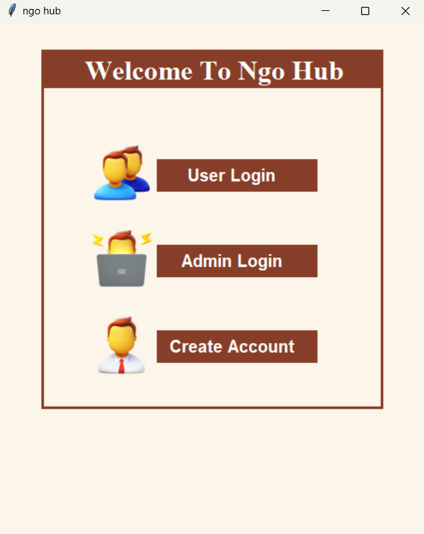

# 🧩 NGO Hub – Mini Project using Python, SQL, and Tkinter

**NGO Hub** is a simple desktop-based application created as a mini project using **Python**, **Tkinter** for GUI, and **SQL** for database operations. It allows users to manage NGO-related data such as user profiles or admin details with a basic graphical interface.

> 🛠️ Built with the goal of learning CRUD operations, database connectivity, and GUI development in Python.

---

## 🚀 Features
- Add, view, and manage NGO data
- Simple GUI interface built with Tkinter
- SQL integration for data storage
- Admin and user access screens (with different image icons)
- Beginner-friendly and modular Python code

---

## 🧰 Tech Stack

| Layer     | Technology        |
|-----------|-------------------|
| Language  | Python            |
| GUI       | Tkinter           |
| Database  | MySQL (or SQLite) |
| Editor    | Visual Studio Code|

---

## 📷 Screenshots

### 🧾 Account Creation Screen

### 🔐 Admin Login Screen

### 📊 Dashboard Screen

---

## 📚 What I Learned
- Connecting Python with MySQL/SQLite databases
- Implementing CRUD operations (Create, Read, Update, Delete)
- Designing a simple UI using Tkinter widgets
- Handling images and GUI elements in a desktop app
- Project structuring and using Git & GitHub for version control

---

## 🔮 Future Improvements
- Add user authentication (login system)
- Improve GUI styling and layout
- Export data to CSV/PDF
- Shift to a web-based version using Flask or Django

---

## 🙋‍♀️ About Me
Hi! I’m Sameeksha Rawat, a 3rd-year B.Tech CSE student passionate about learning full stack development and exploring new technologies.  
This was one of my early projects and a step forward in my development journey.

---

## 🌐 Project Repository
[🔗 GitHub Link](https://github.com/sameeksharawat7/NGO-hub)

